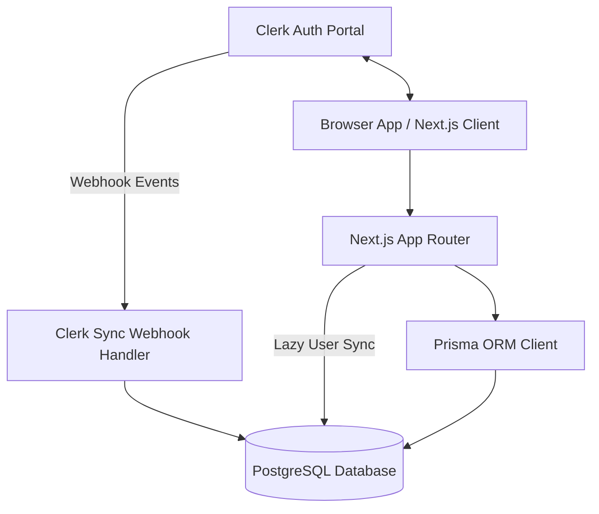

# LedgerFlow — Production Foundation

LedgerFlow is a modern, high-performance shared expense reconciliation platform designed for dynamic group memberships, settle-up optimization, CSV import pipelines, anomaly detection, and realtime audit trails.

---

## Architecture Overview

LedgerFlow is engineered using Next.js 16, React 19, TypeScript, TailwindCSS v4, Prisma ORM, and PostgreSQL.



### Component Details
1. **Frontend App**: Next.js 16 App Router. Styling is built using custom tokens and HSL palettes via TailwindCSS v4 and Framer Motion for premium, modern animations.
2. **Identity & Authentication**: Clerk serves as the source of truth for identity. We support Email, Phone Number, Username, and Google OAuth. Users can sign in without emails (e.g. phone-only or username-only logins).
3. **Database Layer**: PostgreSQL database with Prisma ORM. Local records represent preferences, dynamic membership timelines, expenses, split configurations, settlements, CSV import sessions, anomalies, activity logs, and group messages.
4. **Auth Sync Hook**: Protected requests lazily provision local User and Preference accounts. A verified Next.js webhook endpoint also validates Clerk lifecycle payload signatures with `svix` for production synchronization.

---

## Current Status

Completed:
- **Phase 1**: Next.js, Clerk, routing, layout, design system, environment validation.
- **Phase 2**: Relational Prisma schema, constraints, indexes, and database documentation.
- **Phase 3**: Clerk user synchronization, local user preference initialization, and settings preference updates.
- **Phase 4**: Group CRUD, membership timeline operations, role enforcement, and group activity logs.
- **Phase 5**: Expense CRUD with Equal, Exact, Percentage, and Shares split validation.
- **Phase 6**: Pure balance computation with traceable source expenses and debt simplification.
- **Phase 7**: Settlement creation, listing, history, updates, and settlement activity logs.
- **Phase 8**: Backend CSV import engine with PapaParse parsing, Zod request validation, transaction-backed expense creation, and import session tracking.
- **Phase 9**: Anomaly detection for duplicates, invalid values, unknown members, settlement-like rows, and timeline membership violations.
- **Phase 10**: Import report generation with row counts, rejected row explanations, anomaly summaries, created expense IDs, and processing time.
- **Phase 11**: Dashboard aggregation APIs for overview metrics, recent activity, imports, anomalies, group analytics, expense analytics, settlement analytics, and reporting summaries.

---

## Database Architecture

LedgerFlow utilizes a fully relational schema containing the following 11 models:

- **User**: Clerk identity fields (nullable email, phone, and username to support diverse authentication options).
- **UserPreference**: Settings for theme, default currency, and notifications.
- **Group**: Groups of members with description, status, and currency options.
- **GroupMember**: Soft-timeline membership records (`joinedAt`, `leftAt`, `isActive`) ensuring historical expenses are audited correctly.
- **Expense**: Core expense records supporting multi-currency fields (`originalAmount`, `originalCurrency`, `exchangeRate`, `baseAmount`).
- **ExpenseParticipant**: Stores raw split parameters (`splitValue`) for Equal, Exact, Percentage, and Share split types.
- **Settlement**: Peer-to-peer debt resolution records distinct from standard expenses.
- **ImportSession**: Tracks CSV metadata, validation logs, and errors.
- **Anomaly**: Tracks schema, dates, duplicate, and membership anomalies in imported logs.
- **ActivityLog**: Append-only auditing logs capturing action payloads.
- **Message**: Real-time group chat logs.

---

## User Synchronization & Preferences (Phase 3)

Clerk remains the source of truth for identity. LedgerFlow mirrors selected Clerk profile fields into the local `User` table so future groups, expenses, settlements, imports, and audit logs can enforce relational integrity.

Local development does not depend on Clerk webhook delivery. Every protected dashboard request lazily synchronizes the authenticated Clerk user into the local database before rendering application pages. This creates or updates:
- the local `User` record
- the associated `UserPreference` record

The Clerk webhook endpoint is:

```text
POST /api/webhooks/clerk
```

Handled Clerk events:
- `user.created`: upserts the local user and initializes preferences.
- `user.updated`: updates mirrored identity fields without resetting preferences.
- `user.deleted`: logs the event and preserves the local user record for financial auditability.

Webhook signatures are verified with `svix` against the raw request body from `req.text()`. User synchronization is idempotent through Prisma `upsert` calls. Preference defaults are:
- `theme`: `dark`
- `currency`: `INR`
- `notificationsEnabled`: `true`

The settings page allows authenticated users to update their LedgerFlow-owned preferences without modifying Clerk identity data.

---

## Backend Services (Phases 4-7)

LedgerFlow backend business logic is organized by domain under `src/lib`:
- `groups`: group creation, updates, archive behavior, and group reads.
- `memberships`: soft membership removal, role changes, member lists, and timeline reads.
- `expenses`: expense lifecycle and raw split configuration validation.
- `balances`: pure read-time balance calculation and debt simplification.
- `settlements`: settlement lifecycle, validation, and settlement history.
- `imports`: CSV parsing, row validation, anomaly detection, and transactional import writes.
- `reports`: import report generation for audit and review.
- `dashboard`: authenticated aggregation services for dashboard overview, activity, analytics, and reporting endpoints.

Route handlers under `src/app/api` are intentionally thin. They authenticate the current Clerk-backed local user, validate request bodies with Zod, call the relevant service, and serialize the response.

Membership validity is date-bound. A user can participate in an expense only when:

```text
expenseDate >= joinedAt
AND (leftAt IS NULL OR expenseDate <= leftAt)
```

Balances are never persisted. They are computed from active expenses, expense participants, and settlements. Each balance response includes source expense and settlement metadata so owed amounts can be explained during audit or interview review.

Settlements are isolated from expenses. They reduce balances but never mutate or replace expense history.

---

## Business Requirements & Scope

LedgerFlow automates the complexity of group expense settlements. Key requirements include:
- **Flexible Identity Profile**: Nullable contact parameters ensure any Clerk sign-up path succeeds.
- **Timeline-aware Membership**: GroupMember tracking allows members to leave/join dynamically while preserving historical ledger accuracy.
- **Restrictive Deletions**: Deleting users or groups restricts deleting active financial history (Expenses, Settlements, and ImportSessions).
- **Computed Balances**: Balances are derived at read time from immutable financial source records.
- **Micro-animation Interface**: Dashboard layout shell with active item sliding indicators, overlay sheets, and glassmorphism elements.

---

## CSV Import Pipeline Workflow

The backend import engine exposes:
- `POST /api/groups/[groupId]/imports`
- `GET /api/groups/[groupId]/imports`
- `GET /api/imports/[importSessionId]`

The POST route accepts either multipart `file` upload or JSON `{ "filename": "...", "csv": "..." }`. Required CSV headers are:

```text
date,description,amount,currency,paidBy,participants,splitType
```

Supported split types are `EQUAL`, `EXACT`, `PERCENTAGE`, and `SHARES`. Equal splits use participant identifiers such as `alice;bob`; other split types use `identifier:value` pairs such as `alice:60;bob:40`.

The ingestion flow:
1. Create an `ImportSession` and log `IMPORT_STARTED`.
2. Parse CSV rows with PapaParse.
3. Validate row shape, money, currency, dates, split semantics, and group member resolution.
4. Detect anomalies, including duplicate expenses and timeline membership violations.
5. Create accepted expenses in a Prisma transaction.
6. Store anomaly rows with row-level payload context.
7. Generate and persist the import report.
8. Update `ImportSession` to `COMPLETED`, `PARTIAL`, or `FAILED`.

Rejected rows are not silently dropped. Each rejected row is included in `rawErrors` and the import report with human-readable explanations.

---

## Dashboard Aggregation APIs

Phase 11 adds backend-only dashboard APIs. These endpoints use the existing authentication flow and aggregate only records from groups where the current user has an active membership.

```text
GET /api/dashboard/overview
GET /api/dashboard/activity?limit=20
GET /api/dashboard/imports
GET /api/dashboard/anomalies
GET /api/dashboard/groups
GET /api/dashboard/expenses
GET /api/dashboard/settlements
GET /api/dashboard/reports
```

Metrics are computed from real `Group`, `Expense`, `Settlement`, `ImportSession`, `Anomaly`, and `ActivityLog` rows. Dashboard routes do not contain business logic; they authenticate, parse small query inputs where needed, call `src/lib/dashboard`, and return JSON.

---

## Deployment & Setup

### Environment Prerequisites
Copy `.env.local.example` to `.env.local` and define the required values:
- `DATABASE_URL`: Neon PostgreSQL database connection string.
- `NEXT_PUBLIC_CLERK_PUBLISHABLE_KEY` & `CLERK_SECRET_KEY`: Clerk API keys.
- `CLERK_WEBHOOK_SECRET`: Secret token from the Clerk webhook setup page to verify request signatures.
- `PUSHER_APP_ID`, `PUSHER_KEY`, `PUSHER_SECRET`, `PUSHER_CLUSTER`: Realtime notifications setup.

### Development Commands
```bash
# Install dependencies
npm install

# Generate Prisma Client types
npx prisma generate

# Start Next.js development server
npm run dev

# Run linting checks
npm run lint

# Compile production bundle
npm run build
```

---

## Future Enhancements
- **Multi-currency Settlement Logic**: Live FX conversions for settle-ups.
- **Audit Trails**: Pusher-powered real-time log feed displaying settlement histories.

## Assignment Completion Status

### Phase 12
Dashboard UI

### Phase 13
Groups UI

### Phase 14
Membership Management

### Phase 15
Expenses Experience

### Phase 16
Settlements Experience

### Phase 17
Imports Experience

### QA Fixes
- Username/email member search
- Same-day membership validation
- Multipart CSV upload fix
- Database-backed notifications
