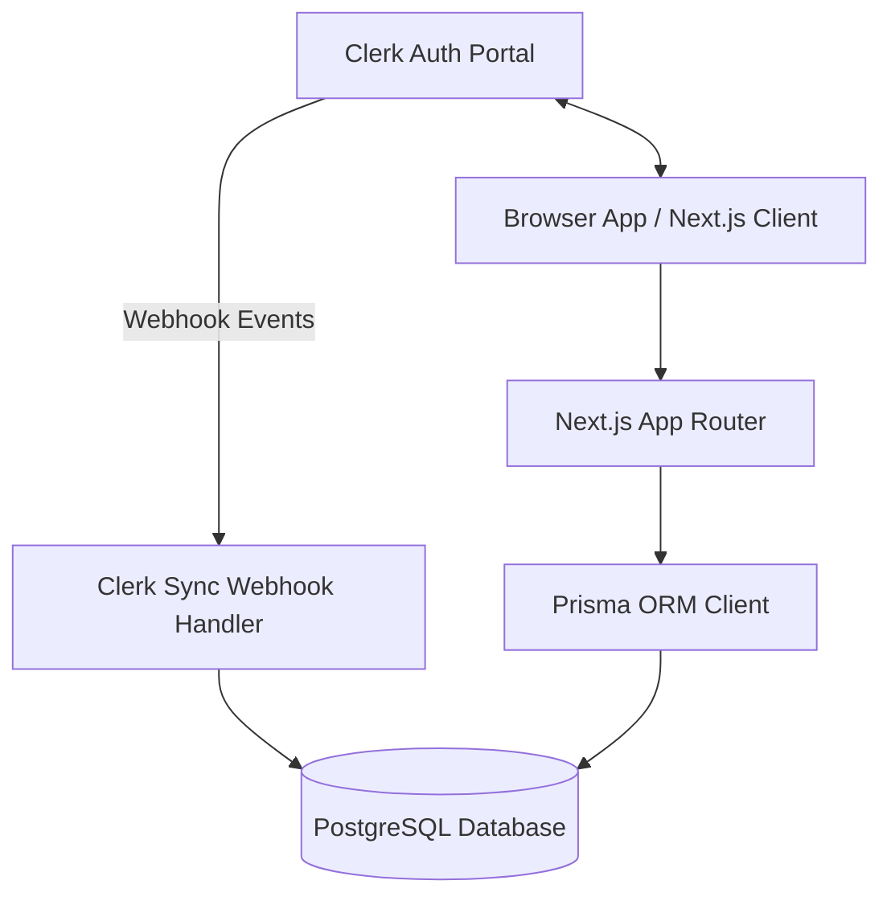

# LedgerFlow — Production Foundation

LedgerFlow is a modern, high-performance shared expense reconciliation platform designed for dynamic group memberships, settle-up optimization, CSV import pipelines, anomaly detection, and realtime audit trails.

---

## Architecture Overview

LedgerFlow is engineered using Next.js 15, React 19, TypeScript, TailwindCSS v4, Prisma ORM, and PostgreSQL.



### Component Details
1. **Frontend App**: Next.js 15 App Router. Styling is built using custom tokens and HSL palettes via TailwindCSS v4 and Framer Motion for premium, modern animations.
2. **Identity & Authentication**: Clerk serves as the source of truth for identity. We support Email, Phone Number, Username, and Google OAuth. Users can sign in without emails (e.g. phone-only or username-only logins).
3. **Database Layer**: Neon Serverless PostgreSQL with Prisma ORM. Local records represent preferences, dynamic memberships, peer-to-peer balances, and app-specific custom metadata.
4. **Auth Sync Hook**: A transactional Next.js webhook endpoint validates payload signatures using `svix` to provision local User and Preference accounts, responding to Clerk lifecycle events.

---

## Business Requirements & Scope

LedgerFlow automates the complexity of group expense settlements. Key requirements include:
- **Flexible Identity Profile**: Nullable contact parameters ensure any Clerk sign-up path succeeds.
- **Relational Integrity**: Enforces strict cascading relations from users to memberships, preferences, and calculated balance entries.
- **Micro-animation Interface**: Dashboard layout shell with active item sliding indicators, overlay sheets, and glassmorphism elements.

---

## CSV Import Pipeline Workflow

Phase 2 will integrate the CSV parsing engine. The planned ingestion flow:
1. **Upload**: User drags-and-drops or selects a CSV containing expense records.
2. **Parsing**: PapaParse extracts raw rows safely in the browser sandbox.
3. **Validation**: Zod schema parses fields (monetary ranges, date parameters, and names).
4. **Ingestion**: Server action verifies permissions, checks for anomalies, maps expenses to members, and updates active balances transactionally.

---

## Deployment & Setup

### Environment Prerequisites
Copy `.env.local.example` to `.env.local` and define the required values:
- `DATABASE_URL`: Neon PostgreSQL database connection string.
- `NEXT_PUBLIC_CLERK_PUBLISHABLE_KEY` & `CLERK_SECRET_KEY`: Clerk API keys.
- `CLERK_WEBHOOK_SECRET`: Secret token from the Clerk webhook setup page to verify request signatures.
- `PUSHER_APP_ID`, `PUSHER_KEY`, `PUSHER_SECRET`, `PUSHER_CLUSTER`: Realtime notifications setup.

### Development Commands
```bash
# Install dependencies
npm install

# Generate Prisma Client types
npx prisma generate

# Start Next.js development server
npm run dev

# Run linting checks
npm run lint

# Compile production bundle
npm run build
```

---

## Future Enhancements
- **Multi-currency Settlement Logic**: Live FX conversions for settle-ups.
- **Anomaly Detection Engine**: Auto-flags suspicious entries (e.g., duplicated CSV records).
- **Audit Trails**: Pusher-powered real-time log feed displaying settlement histories.
