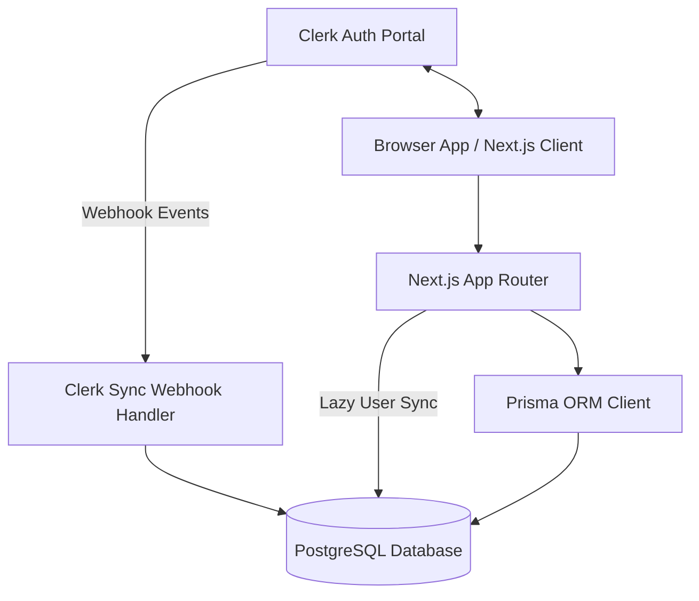

# LedgerFlow — Production Foundation

LedgerFlow is a modern, high-performance shared expense reconciliation platform designed for dynamic group memberships, settle-up optimization, CSV import pipelines, anomaly detection, and realtime audit trails.

---

## Architecture Overview

LedgerFlow is engineered using Next.js 16, React 19, TypeScript, TailwindCSS v4, Prisma ORM, and PostgreSQL.



### Component Details
1. **Frontend App**: Next.js 16 App Router. Styling is built using custom tokens and HSL palettes via TailwindCSS v4 and Framer Motion for premium, modern animations.
2. **Identity & Authentication**: Clerk serves as the source of truth for identity. We support Email, Phone Number, Username, and Google OAuth. Users can sign in without emails (e.g. phone-only or username-only logins).
3. **Database Layer**: PostgreSQL database with Prisma ORM. Local records represent preferences, dynamic membership timelines, expenses, split configurations, settlements, CSV import sessions, anomalies, activity logs, and group messages.
4. **Auth Sync Hook**: Protected requests lazily provision local User and Preference accounts. A verified Next.js webhook endpoint also validates Clerk lifecycle payload signatures with `svix` for production synchronization.

---

## Current Status

Completed:
- **Phase 1**: Next.js, Clerk, routing, layout, design system, environment validation.
- **Phase 2**: Relational Prisma schema, constraints, indexes, and database documentation.
- **Phase 3**: Clerk user synchronization, local user preference initialization, and settings preference updates.

---

## Database Architecture

LedgerFlow utilizes a fully relational schema containing the following 11 models:

- **User**: Clerk identity fields (nullable email, phone, and username to support diverse authentication options).
- **UserPreference**: Settings for theme, default currency, and notifications.
- **Group**: Groups of members with description, status, and currency options.
- **GroupMember**: Soft-timeline membership records (`joinedAt`, `leftAt`, `isActive`) ensuring historical expenses are audited correctly.
- **Expense**: Core expense records supporting multi-currency fields (`originalAmount`, `originalCurrency`, `exchangeRate`, `baseAmount`).
- **ExpenseParticipant**: Stores raw split parameters (`splitValue`) for Equal, Exact, Percentage, and Share split types.
- **Settlement**: Peer-to-peer debt resolution records distinct from standard expenses.
- **ImportSession**: Tracks CSV metadata, validation logs, and errors.
- **Anomaly**: Tracks schema, dates, duplicate, and membership anomalies in imported logs.
- **ActivityLog**: Append-only auditing logs capturing action payloads.
- **Message**: Real-time group chat logs.

---

## User Synchronization & Preferences (Phase 3)

Clerk remains the source of truth for identity. LedgerFlow mirrors selected Clerk profile fields into the local `User` table so future groups, expenses, settlements, imports, and audit logs can enforce relational integrity.

Local development does not depend on Clerk webhook delivery. Every protected dashboard request lazily synchronizes the authenticated Clerk user into the local database before rendering application pages. This creates or updates:
- the local `User` record
- the associated `UserPreference` record

The Clerk webhook endpoint is:

```text
POST /api/webhooks/clerk
```

Handled Clerk events:
- `user.created`: upserts the local user and initializes preferences.
- `user.updated`: updates mirrored identity fields without resetting preferences.
- `user.deleted`: logs the event and preserves the local user record for financial auditability.

Webhook signatures are verified with `svix` against the raw request body from `req.text()`. User synchronization is idempotent through Prisma `upsert` calls. Preference defaults are:
- `theme`: `dark`
- `currency`: `INR`
- `notificationsEnabled`: `true`

The settings page allows authenticated users to update their LedgerFlow-owned preferences without modifying Clerk identity data.

---

## Business Requirements & Scope

LedgerFlow automates the complexity of group expense settlements. Key requirements include:
- **Flexible Identity Profile**: Nullable contact parameters ensure any Clerk sign-up path succeeds.
- **Timeline-aware Membership**: GroupMember tracking allows members to leave/join dynamically while preserving historical ledger accuracy.
- **Restrictive Deletions**: Deleting users or groups restricts deleting active financial history (Expenses, Settlements, and ImportSessions).
- **Micro-animation Interface**: Dashboard layout shell with active item sliding indicators, overlay sheets, and glassmorphism elements.

---

## CSV Import Pipeline Workflow

Phase 2 establishes the database schema for the CSV parsing engine. The planned ingestion flow:
1. **Upload**: User drags-and-drops or selects a CSV containing expense records.
2. **Parsing**: PapaParse extracts raw rows safely in the browser sandbox.
3. **Validation**: Zod schema parses fields (monetary ranges, date parameters, and names).
4. **Ingestion**: Server action verifies permissions, checks for anomalies, maps expenses to members, and updates active balances transactionally.

---

## Deployment & Setup

### Environment Prerequisites
Copy `.env.local.example` to `.env.local` and define the required values:
- `DATABASE_URL`: Neon PostgreSQL database connection string.
- `NEXT_PUBLIC_CLERK_PUBLISHABLE_KEY` & `CLERK_SECRET_KEY`: Clerk API keys.
- `CLERK_WEBHOOK_SECRET`: Secret token from the Clerk webhook setup page to verify request signatures.
- `PUSHER_APP_ID`, `PUSHER_KEY`, `PUSHER_SECRET`, `PUSHER_CLUSTER`: Realtime notifications setup.

### Development Commands
```bash
# Install dependencies
npm install

# Generate Prisma Client types
npx prisma generate

# Start Next.js development server
npm run dev

# Run linting checks
npm run lint

# Compile production bundle
npm run build
```

---

## Future Enhancements
- **Multi-currency Settlement Logic**: Live FX conversions for settle-ups.
- **Anomaly Detection Engine**: Auto-flags suspicious entries (e.g., duplicated CSV records).
- **Audit Trails**: Pusher-powered real-time log feed displaying settlement histories.
